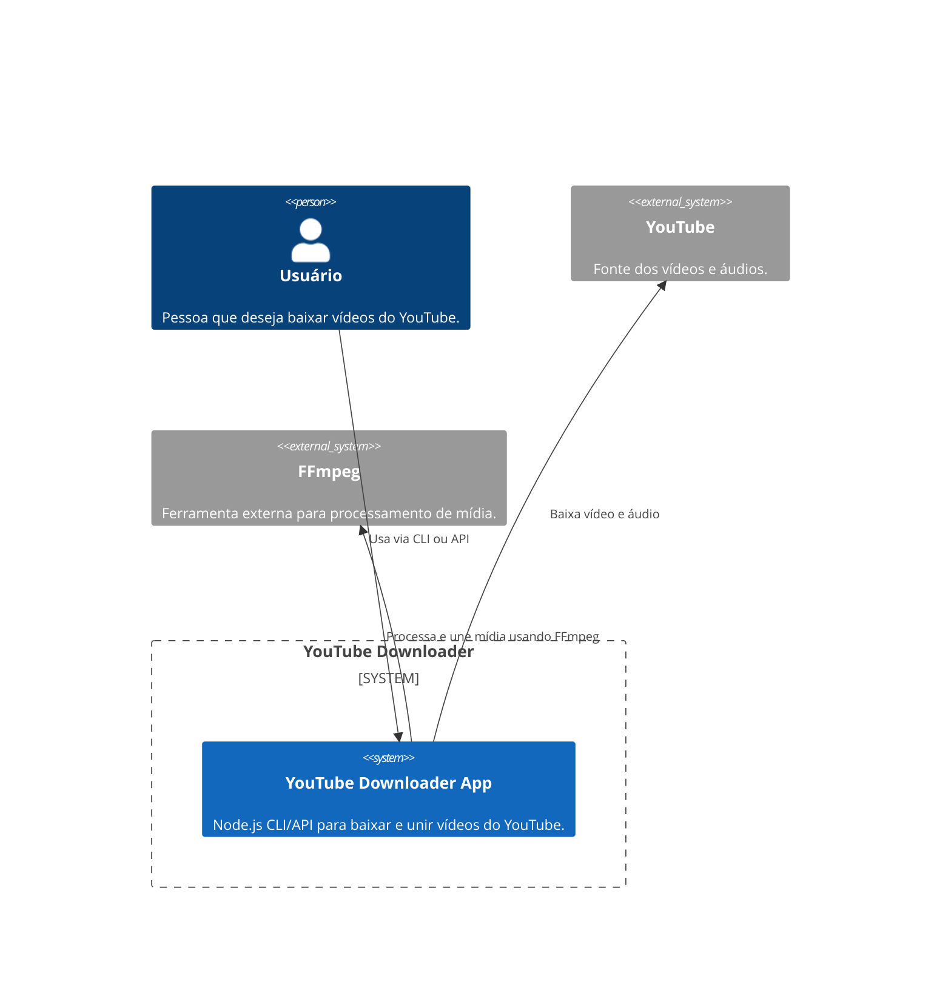

# C4 Model - Context Diagram

Este diagrama mostra o sistema **YouTube Downloader** no contexto de seus usuários e sistemas externos.

## Explicação
- O **Usuário** interage com o sistema via CLI ou API.
- O sistema faz download de vídeo/áudio do **YouTube**.
- O sistema utiliza o **FFmpeg** para unir e processar os arquivos de mídia. 