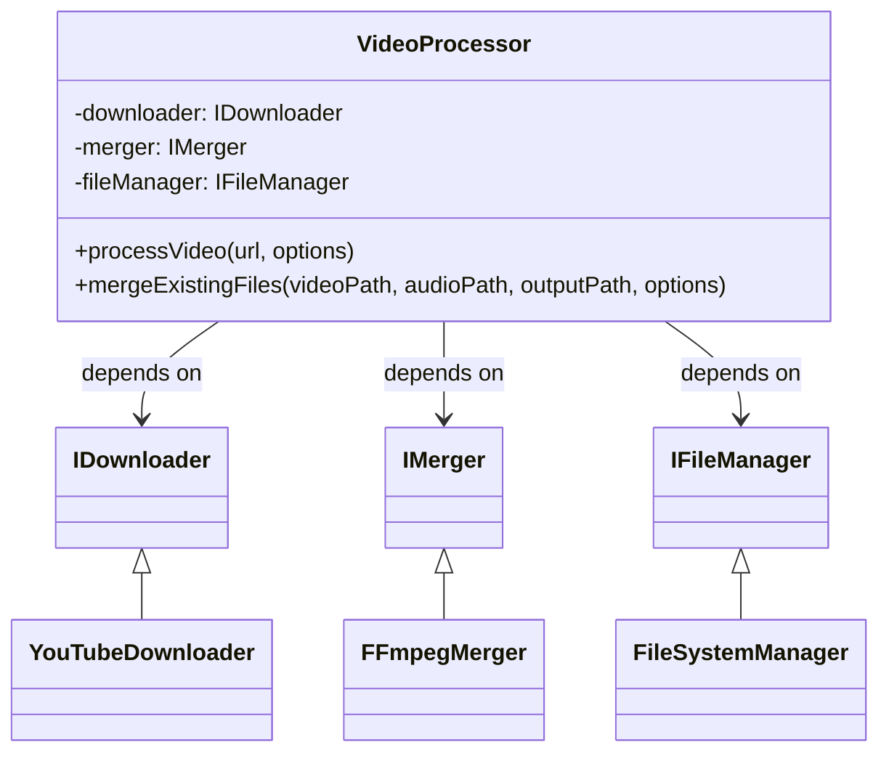

# C4 Model - Code Diagram

Este diagrama mostra detalhes de implementação do componente `VideoProcessor`.

## Explicação
- O `VideoProcessor` depende de abstrações (interfaces) para download, merge e gerenciamento de arquivos.
- As implementações concretas são injetadas via factory.
- O design facilita testes, manutenção e extensibilidade. 