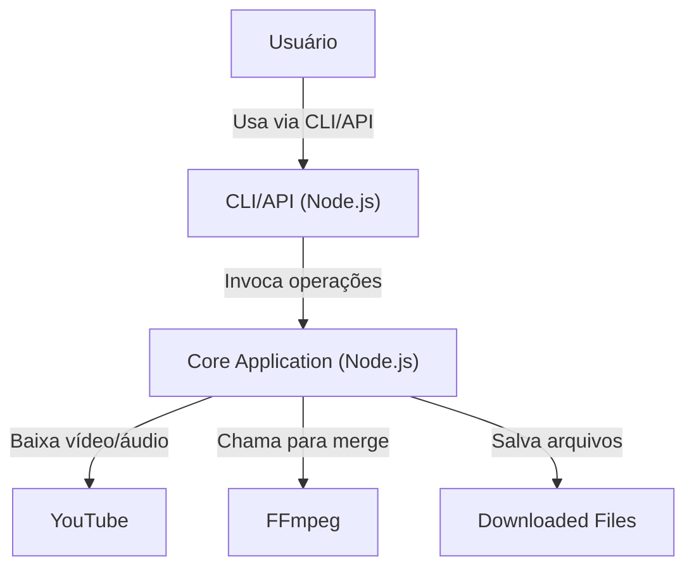

# C4 Model - Container Diagram

Este diagrama mostra os principais containers do sistema **YouTube Downloader**.

## Explicação
- O usuário interage via CLI/API.
- O container principal orquestra o fluxo de download, merge e gerenciamento de arquivos.
- Os arquivos baixados são salvos no sistema de arquivos.
- FFmpeg é chamado como ferramenta externa para merge. 