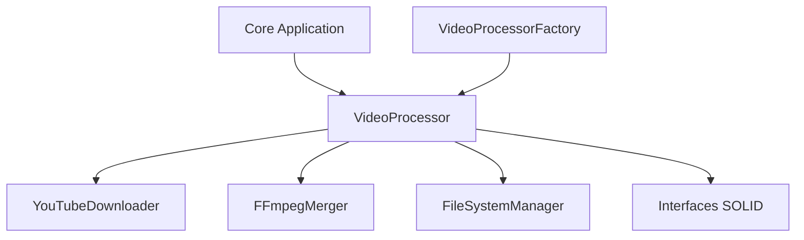

# C4 Model - Component Diagram

Este diagrama mostra os principais componentes internos do container "Core Application" do **YouTube Downloader**.

## Explicação
- O `VideoProcessor` é o orquestrador do fluxo.
- Os serviços são injetados via factory e abstraídos por interfaces.
- Cada componente tem responsabilidade única, seguindo SOLID. 