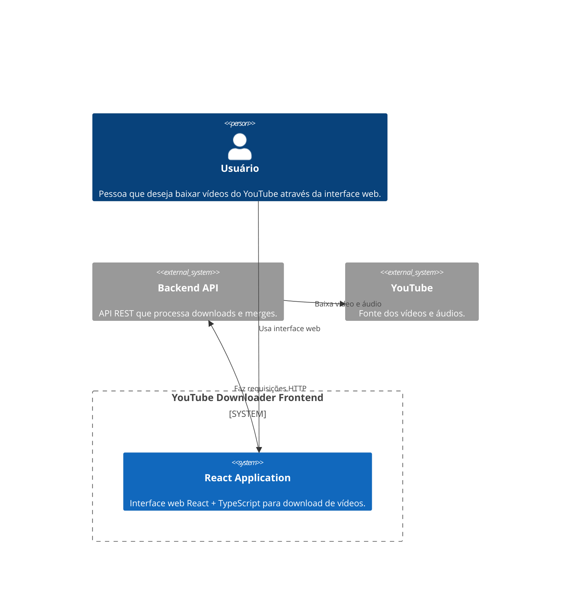

# C4 Model - Context Diagram (Frontend)

Este diagrama mostra o sistema **YouTube Downloader Frontend** no contexto de seus usuários e sistemas externos.

## Explicação
- O **Usuário** interage com o sistema através da interface web React.
- O **React Application** se comunica com o **Backend API** via requisições HTTP.
- O **Backend API** faz o download e processamento dos vídeos do **YouTube**.
- A interface web fornece uma experiência amigável para o usuário final. 