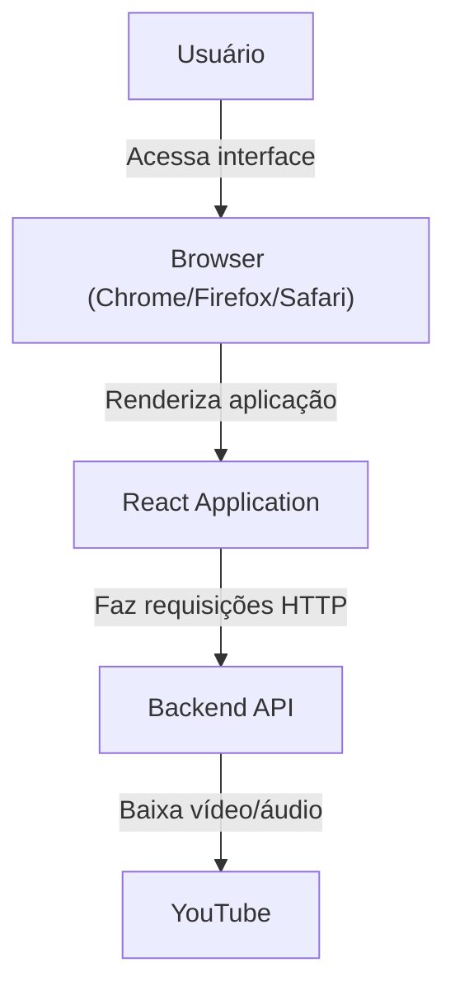

# C4 Model - Container Diagram (Frontend)

Este diagrama mostra os principais containers do sistema **YouTube Downloader Frontend**.

## Explicação
- O **Usuário** acessa a aplicação através do navegador web.
- O **Browser** renderiza a aplicação React e gerencia o estado da interface.
- A **React Application** se comunica com o **Backend API** via requisições HTTP.
- O **Backend API** processa os downloads e retorna os resultados para o frontend.
- A interface web fornece feedback em tempo real sobre o progresso dos downloads. 