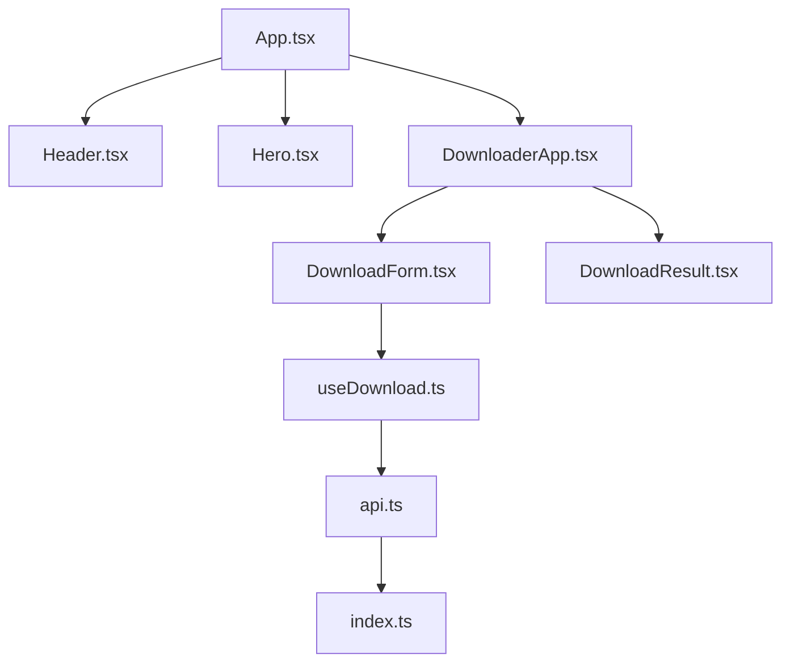

# C4 Model - Component Diagram (Frontend)

Este diagrama mostra os principais componentes internos da **React Application** do **YouTube Downloader Frontend**.

## Explicação
- O **App.tsx** é o componente raiz que orquestra a aplicação.
- **Header** e **Hero** fornecem a interface de navegação e apresentação.
- **DownloaderApp** gerencia o fluxo principal de download.
- **DownloadForm** e **DownloadResult** são componentes específicos para entrada e exibição de resultados.
- **useDownload** é um custom hook que gerencia o estado e comunicação com a API.
- **api.ts** centraliza as chamadas HTTP para o backend.
- **types/index.ts** define as interfaces TypeScript compartilhadas. 