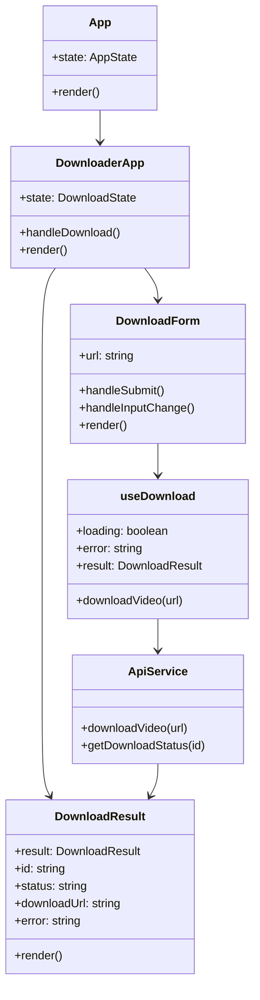

# C4 Model - Code Diagram (Frontend)

Este diagrama mostra detalhes de implementação dos principais componentes do frontend.

## Explicação
- **App** é o componente raiz que gerencia o estado global da aplicação.
- **DownloaderApp** orquestra o fluxo de download e gerencia o estado local.
- **DownloadForm** e **DownloadResult** são componentes funcionais que lidam com entrada e saída.
- **useDownload** é um custom hook que encapsula a lógica de comunicação com a API.
- **ApiService** centraliza as chamadas HTTP e gerencia a comunicação com o backend.
- **DownloadResult** define a estrutura de dados para resultados de download.
- O design segue padrões React modernos com hooks e componentes funcionais. 